# Documentation technique complète - Decathlon Sport Buddy

## 1. Vue générale du projet

### 1.1 Identification

| Élément | Valeur constatée dans le projet |
|---|---|
| Nom du dépôt | `projet_sport` |
| Nom backend Maven | `decathlon_project` |
| Nom applicatif Spring | `decathlon-sport-buddy` |
| Nom frontend npm | `decathlon-sport-buddy-frontend` |
| Domaine fonctionnel | Coaching sportif, catalogue Decathlon, événements sportifs, recommandations, administration |
| Type d’application | Application web full-stack conteneurisée |

Le projet est structuré comme un monorepo:

```text
projet_sport-main/
├── backend/        Application Spring Boot
├── frontend/       Application React/Vite
├── database/       Image MySQL et dump SQL initial
├── .github/        Dossier technique de hooks java-upgrade, sans workflow CI/CD GitHub Actions
├── docker-compose.yml
└── README.md
```

### 1.2 Objectif de l’application

L’application sert de compagnon sportif orienté Decathlon. Elle permet à un utilisateur de créer un compte, renseigner un profil sportif, consulter des produits, suivre des programmes d’entraînement, démarrer et terminer des séances, obtenir des recommandations côté frontend et consulter des événements sportifs importés.

Le back-office administrateur permet de consulter des statistiques globales, gérer les produits, les programmes, les événements et explorer certaines tables de données importées.

### 1.3 Problème résolu

Le projet répond à un besoin d’agrégation entre:

| Besoin | Réponse applicative |
|---|---|
| Profilage sportif utilisateur | Profil avec âge, ville, hobby, objectif, niveau et budget |
| Catalogue produit | Consultation de produits applicatifs ou importés depuis `catalogue_produits` |
| Coaching | Programmes, séances utilisateur, points de fidélité |
| Événements | Consultation d’événements sportifs importés depuis `agenda_events` |
| Recommandation | Scoring local côté React sur produits, programmes et événements |
| Administration | Dashboard, gestion CRUD partielle, exploration de tables SQL |

### 1.4 Stack technique détectée

| Technologie | Présence | Usage réel | Justification probable |
|---|---:|---|---|
| Java 21 | Oui | Langage backend | Version moderne, support records, runtime LTS récent |
| Spring Boot 3.2.5 | Oui | Application REST | Accélère la construction d’API web et l’intégration sécurité/JPA |
| Spring Web | Oui | Contrôleurs REST | Exposition HTTP JSON |
| Spring Security | Oui | Authentification et autorisation | Protection API par JWT et rôles |
| JWT/JJWT 0.12.6 | Oui | Token stateless | Éviter les sessions serveur |
| Spring Data JPA/Hibernate | Oui | ORM pour entités métier | Mapping objet-relationnel standard |
| JdbcTemplate | Oui | Lecture de tables importées | Requêtes directes sur tables non modélisées JPA |
| MySQL 8.4 | Oui | Base de données Docker | Persistance relationnelle et import SQL |
| Lombok | Oui | Réduction boilerplate | `@Getter`, `@Setter`, `@Builder`, `@RequiredArgsConstructor` |
| React 19 | Oui | Frontend SPA | Interface utilisateur dynamique |
| Vite 7 | Oui | Build frontend | Développement rapide et bundle moderne |
| React Router 7 | Oui | Routing SPA | Navigation publique, protégée et admin |
| TanStack React Query | Oui | Fetch/cache API | Gestion des requêtes, cache et mutations |
| lucide-react | Oui | Icônes UI | Iconographie frontend |
| Docker | Oui | Backend, frontend, database | Packaging reproductible |
| Docker Compose | Oui | Orchestration locale | Démarrage coordonné MySQL/backend/frontend |
| Nginx | Oui | Serveur frontend statique | Servir le build React et fallback SPA |
| GitHub Actions | Non | Aucun workflow détecté | Dossier `.github` présent, mais pas `.github/workflows` |
| Jenkins | Non | Aucun Jenkinsfile détecté | Non implémenté dans ce dépôt |
| Kubernetes | Non | Aucun manifest détecté | Non implémenté dans ce dépôt |
| FastAPI | Non | Aucun service Python détecté | Non implémenté |
| Redis | Non | Aucun client/config détecté | Non implémenté |
| Kafka | Non | Aucun broker/client détecté | Non implémenté |
| Ray | Non | Aucun code Python/Ray détecté | Non implémenté |
| MLflow | Non | Aucun tracking ML détecté | Non implémenté |
| Hugging Face | Non | Aucun modèle/transformers détecté | Non implémenté |

Important: les technologies FastAPI, Redis, Kafka, Ray, MLflow, Hugging Face, Jenkins et Kubernetes sont mentionnées dans la demande, mais ne sont pas présentes dans les fichiers du projet. Elles ne sont donc pas décrites comme des composants actifs.

## 2. Architecture globale

### 2.1 Style architectural

L’application est une architecture web full-stack conteneurisée composée de trois services principaux:

| Service | Rôle | Technologie | Port hôte | Port conteneur |
|---|---|---|---:|---:|
| `frontend` | SPA React servie par Nginx | React/Vite/Nginx | 8080 | 80 |
| `backend` | API REST métier | Spring Boot | 8081 | 8081 |
| `mysql` | Base relationnelle | MySQL 8.4 | 3307 | 3306 |

Le backend est monolithique, organisé en couches:

```text
Controllers REST
    ↓
Services métier transactionnels
    ↓
Repositories JPA + JdbcTemplate
    ↓
Base MySQL
```

Le frontend est une SPA React:

```text
Pages React
    ↓
Hooks React Query
    ↓
Modules api/*
    ↓
fetch HTTP avec Authorization Bearer
    ↓
Spring Boot API
```

### 2.2 Diagramme logique

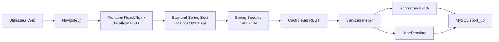

### 2.3 Diagramme des composants

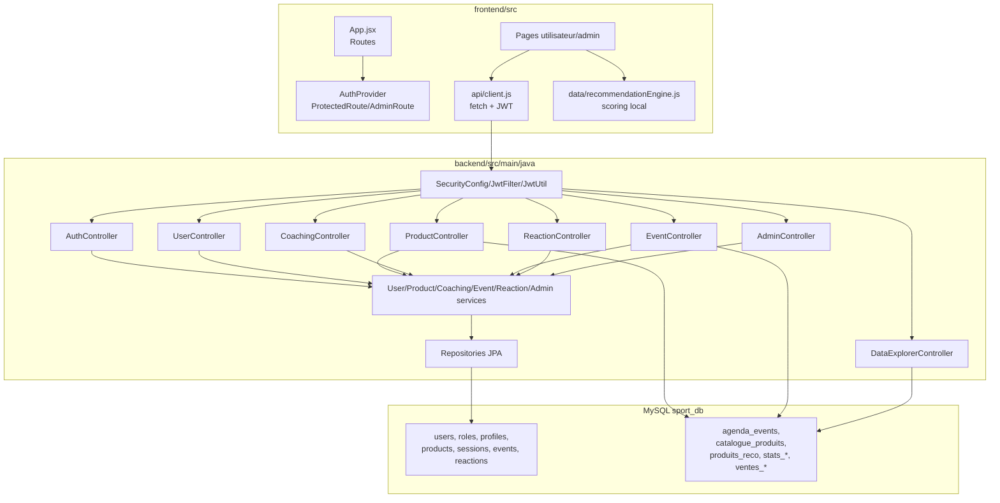

### 2.4 Diagramme de déploiement Docker

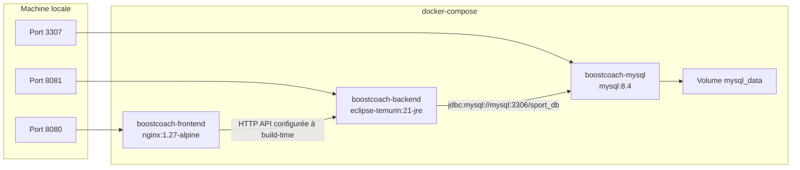

### 2.5 Diagramme de communication

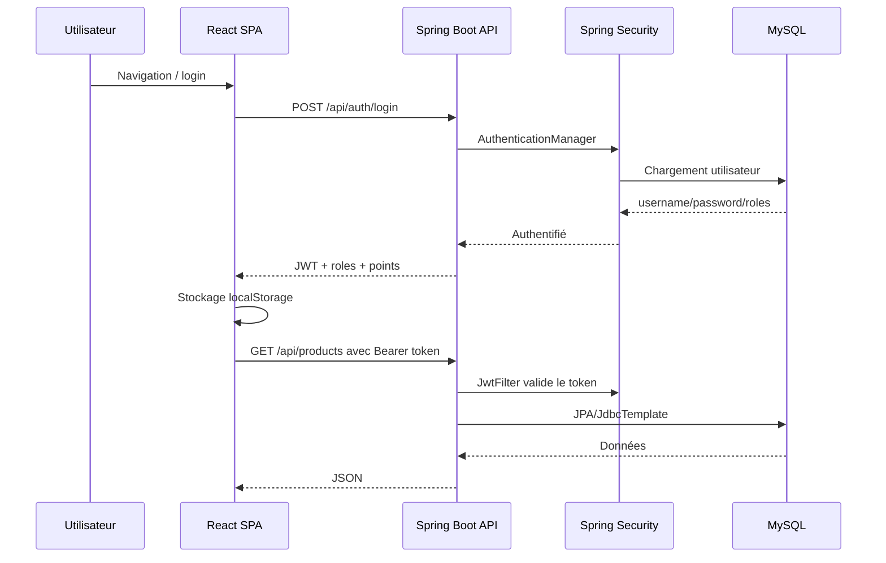

## 3. Analyse Spring Boot

### 3.1 Classe principale

La classe `DecathlonProjectApplication` porte `@SpringBootApplication`. Cette annotation combine:

| Annotation implicite | Rôle |
|---|---|
| `@Configuration` | Déclare une source de beans |
| `@EnableAutoConfiguration` | Active l’auto-configuration Spring Boot |
| `@ComponentScan` | Scanne le package `com.example.decathlon_project` |

Flux de démarrage:

1. `SpringApplication.run(...)` démarre le contexte.
2. Spring détecte les composants: contrôleurs, services, repositories, sécurité, `DataInitializer`.
3. Les repositories JPA sont générés.
4. La chaîne Spring Security est initialisée.
5. `DataInitializer` s’exécute via `CommandLineRunner`.

### 3.2 Structure des packages backend

| Package | Contenu | Responsabilité |
|---|---|---|
| `controller` | 8 contrôleurs REST | Exposer les endpoints HTTP |
| `service` | 6 services | Logique métier, transactions |
| `repository` | 7 repositories JPA | Accès ORM aux entités |
| `model` | Entités et enums | Modèle de domaine |
| `DTO` | Requêtes/réponses | Contrats JSON partiels |
| `security` | JWT, Spring Security | Authentification et autorisation |
| `exception` | Exceptions et handler global | Réponses d’erreur normalisées |

### 3.3 Contrôleurs

| Contrôleur | Base path | Rôle |
|---|---|---|
| `AuthController` | `/api/auth` | Inscription et connexion |
| `UserController` | `/api/users` | Profil connecté et consultation utilisateurs |
| `ProductController` | `/api/products` | Catalogue, disponibilité, CRUD admin |
| `CoachingController` | `/api/coaching` | Programmes et séances |
| `EventController` | `/api/events` | Événements sportifs |
| `ReactionController` | `/api/reactions` | Likes/coeurs sur produits/programmes |
| `AdminController` | `/api/admin` | Dashboard et utilisateurs admin |
| `DataExplorerController` | `/api/data` | Prévisualisation de tables importées |

### 3.4 Services métier

| Service | Dépendances injectées | Responsabilités principales |
|---|---|---|
| `UserService` | `UserRepository`, `SportProfileRepository`, `PasswordEncoder` | Inscription, profil, points fidélité |
| `ProductService` | `ProductRepository`, `JdbcTemplate` | Produits JPA et catalogue importé |
| `CoachingService` | `TrainingProgramRepository`, `SessionRepository`, `UserRepository` | Programmes, séances, points |
| `SportEventService` | `SportEventRepository`, `JdbcTemplate` | Événements JPA ou importés |
| `ReactionService` | `ReactionRepository`, `UserRepository` | Toggle, count, résumé |
| `AdminDashboardService` | Repositories principaux | Statistiques d’administration |

### 3.5 Exemple de flux d’inscription

Code métier clé, issu de `UserService.register`:

```java
if (userRepository.existsByUsername(request.getUsername())) {
    throw new ConflictException("Ce nom d'utilisateur est déjà pris.");
}
if (userRepository.existsByEmail(request.getEmail())) {
    throw new ConflictException("Cet email est déjà utilisé.");
}
User user = User.builder()
        .username(request.getUsername())
        .email(request.getEmail())
        .password(passwordEncoder.encode(request.getPassword()))
        .roles(Set.of(Role.ROLE_USER))
        .loyaltyPoints(0)
        .build();
```

Explication:

| Ligne logique | Effet |
|---|---|
| Vérification username | Empêche les doublons applicatifs avant insertion |
| Vérification email | Empêche un compte multiple avec même email |
| `passwordEncoder.encode` | Hash BCrypt du mot de passe |
| `roles(Set.of(...))` | Attribution du rôle utilisateur |
| `loyaltyPoints(0)` | Initialisation du programme fidélité |

Ensuite, un `SportProfile` est créé avec les champs du formulaire d’inscription et lié à l’utilisateur via `@OneToOne`.

### 3.6 Initialisation des données

`DataInitializer` est un `@Component` qui implémente `CommandLineRunner`.

Responsabilités:

1. Corriger les stocks produits nuls ou négatifs avec `UPDATE product_stock SET quantity = 10 WHERE quantity <= 0`.
2. S’arrêter si des utilisateurs existent déjà.
3. Créer deux utilisateurs de test:
   - `admin/admin123` avec `ROLE_ADMIN`.
   - `oum/oum123` avec `ROLE_USER`.
4. Créer quelques produits, programmes et événements de démonstration.

Remarque: les mots de passe de démonstration sont présents dans le code. C’est acceptable pour un environnement de test, mais à proscrire en production.

## 4. Analyse des APIs REST

### 4.1 Tableau complet des endpoints

| Méthode | URL | Sécurité | Paramètres/body | Réponse métier |
|---|---|---|---|---|
| POST | `/api/auth/register` | Public | Body `RegisterRequest` validé | `201`, message |
| POST | `/api/auth/login` | Public | Body `LoginRequest` validé | `200`, JWT, username, roles, points |
| GET | `/api/users/me` | Authentifié | Bearer token | Utilisateur connecté |
| GET | `/api/users/me/profile` | Authentifié | Bearer token | Profil sportif |
| PUT | `/api/users/me/profile` | Authentifié | Body `SportProfileDTO` | Profil sauvegardé |
| GET | `/api/users` | Authentifié selon code; devrait être admin | Aucun | Liste utilisateurs |
| GET | `/api/users/{id}` | Authentifié selon code; devrait être admin | Path `id` | Utilisateur |
| GET | `/api/products` | Authentifié | Query `category`, `search` | Liste `ProductResponse` |
| GET | `/api/products/{id}` | Authentifié | Path `id` | Produit |
| GET | `/api/products/{id}/availability` | Authentifié | Path `id` | Stock par ville |
| GET | `/api/products/{id}/availability/{city}` | Authentifié | Path `id`, `city` | Disponibilité booléenne |
| POST | `/api/products` | Admin | Body `Product` | Produit créé |
| PUT | `/api/products/{id}` | Admin | Path `id`, body `Product` | Produit modifié |
| DELETE | `/api/products/{id}` | Admin | Path `id` | `204` |
| PATCH | `/api/products/{id}/stock` | Authentifié dans `SecurityConfig` actuel | Query `city`, `quantity` | Message |
| GET | `/api/coaching/programs` | Authentifié | Query `objective`, `category` | Programmes |
| GET | `/api/coaching/programs/{id}` | Authentifié | Path `id` | Programme |
| POST | `/api/coaching/programs` | Admin via `@PreAuthorize` | Body `TrainingProgram` | Programme créé |
| DELETE | `/api/coaching/programs/{id}` | Admin via `@PreAuthorize` | Path `id` | `204` |
| GET | `/api/coaching/sessions` | Authentifié | Bearer token | Séances utilisateur |
| POST | `/api/coaching/sessions/start` | Authentifié | Query `programId`, `label` | Séance créée |
| POST | `/api/coaching/sessions/{sessionId}/complete` | Authentifié | Path `sessionId` | Message + points |
| GET | `/api/coaching/sessions/stats` | Authentifié | Bearer token | Séances complétées + points |
| GET | `/api/events` | Authentifié | Query `city`, `type`, `upcomingOnly` | Événements |
| GET | `/api/events/{id}` | Authentifié | Path `id` | Événement |
| POST | `/api/events` | Authentifié dans `SecurityConfig` actuel | Body `SportEvent` | Événement créé |
| PUT | `/api/events/{id}` | Authentifié dans `SecurityConfig` actuel | Body `SportEvent` | Événement modifié |
| DELETE | `/api/events/{id}` | Authentifié dans `SecurityConfig` actuel | Path `id` | `204` |
| POST | `/api/reactions/toggle` | Authentifié | Query `targetId`, `targetType` | Active/count |
| GET | `/api/reactions/summary` | Authentifié | Query `targetId`, `targetType` | Count + hasReacted |
| GET | `/api/reactions/count` | Authentifié | Query `targetId`, `targetType` | Count |
| GET | `/api/admin/dashboard` | Admin | Aucun | Statistiques |
| GET | `/api/admin/users` | Admin | Aucun | Utilisateurs |
| GET | `/api/admin/users/{id}` | Admin | Path `id` | Utilisateur |
| GET | `/api/data/tables` | Authentifié | Aucun | Tables autorisées + nombre de lignes |
| GET | `/api/data/tables/{tableName}` | Authentifié | Path `tableName`, query `limit` | Prévisualisation |

### 4.2 Contrats JSON principaux

`RegisterRequest`:

```json
{
  "username": "reda",
  "email": "reda@example.com",
  "password": "secret123",
  "objective": "perte de poids",
  "hobby": "Running",
  "city": "Casablanca",
  "age": 24,
  "level": "BEGINNER",
  "budget": 1000
}
```

`LoginResponse`:

```json
{
  "token": "eyJhbGciOiJIUzI1NiJ9...",
  "username": "reda",
  "roles": ["ROLE_USER"],
  "loyaltyPoints": 0
}
```

`ProductResponse`:

```json
{
  "id": 1,
  "name": "Chaussures de running",
  "price": 499.0,
  "category": "running",
  "description": "Produit sportif | 300-600 MAD",
  "imageUrl": "https://...",
  "stockByCity": {
    "Casablanca": 12,
    "Rabat": 8
  }
}
```

### 4.3 Sérialisation JSON

Le backend utilise Jackson via Spring Boot. Les dates ne sont pas écrites comme timestamps grâce à:

```properties
spring.jackson.serialization.write-dates-as-timestamps=false
spring.jackson.time-zone=Africa/Casablanca
```

Les champs sensibles ou cycliques sont masqués par `@JsonIgnore`, notamment:

| Entité | Champ ignoré | Raison |
|---|---|---|
| `User` | `password` | Ne jamais exposer le hash |
| `SportProfile` | `user` | Éviter boucle JSON |
| `Session` | `user`, `program` | Éviter chargement/cycle; réponse contrôlée par DTO |

## 5. Base de données

### 5.1 Type et configuration

La base est MySQL, configurée par défaut ainsi:

```properties
spring.datasource.url=jdbc:mysql://localhost:3306/sport_db?createDatabaseIfNotExist=true...
spring.datasource.username=reda
spring.datasource.password=reda123
spring.jpa.hibernate.ddl-auto=update
spring.jpa.open-in-view=false
```

En Docker Compose, le backend utilise:

```text
jdbc:mysql://mysql:3306/sport_db
```

Le port MySQL est exposé sur `3307` côté hôte.

### 5.2 Tables applicatives principales

| Table | Origine | Rôle |
|---|---|---|
| `users` | JPA + SQL | Comptes utilisateur |
| `user_roles` | `@ElementCollection` | Rôles Spring Security |
| `sport_profiles` | JPA + SQL | Profil sportif |
| `profile_objectives` | `@ElementCollection` | Objectifs multiples |
| `products` | JPA + SQL | Produits administrables |
| `product_stock` | `@ElementCollection Map` | Stock par ville |
| `training_programs` | JPA + SQL | Programmes d’entraînement |
| `sessions` | JPA + SQL | Séances utilisateur |
| `sport_events` | JPA + SQL | Événements administrables |
| `reactions` | JPA + SQL | Coeurs sur produit/programme |

### 5.3 Tables importées/exploratoires

Le dump SQL contient aussi des tables analytiques ou importées:

| Table | Usage constaté dans le code |
|---|---|
| `agenda_events` | Utilisée par `SportEventService` comme source prioritaire d’événements |
| `catalogue_produits` | Utilisée par `ProductService` comme source prioritaire de catalogue |
| `produits_reco` | Exposée dans `DataExplorerController`, non utilisée pour le scoring frontend |
| `stats_budget` | Exposée dans l’explorateur |
| `stats_events_ville` | Exposée dans l’explorateur |
| `stats_univers` | Exposée dans l’explorateur |
| `top_sports` | Exposée dans l’explorateur |
| `ventes_digitales` | Exposée dans l’explorateur |
| `ventes_magasins` | Exposée dans l’explorateur |
| `v_events_actifs`, `v_recommandations`, `v_top_fitness`, `v_top_outdoor` | Présentes dans le dump, non listées dans l’explorateur autorisé |

### 5.4 Diagramme relationnel

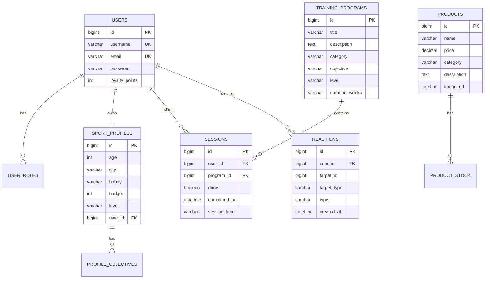

### 5.5 Mapping ORM

| Relation | Mapping Java | Table SQL | Cardinalité |
|---|---|---|---|
| `User.roles` | `@ElementCollection(fetch = EAGER)` | `user_roles` | 1 utilisateur -> N rôles |
| `User.sportProfile` | `@OneToOne(mappedBy="user")` | `sport_profiles.user_id` | 1 -> 1 |
| `SportProfile.objectives` | `@ElementCollection(fetch = EAGER)` | `profile_objectives` | 1 profil -> N objectifs |
| `Product.stockByCity` | `@ElementCollection Map` | `product_stock` | 1 produit -> N villes |
| `TrainingProgram.sessions` | `@OneToMany(mappedBy="program")` | `sessions.program_id` | 1 programme -> N séances |
| `Session.user` | `@ManyToOne(fetch = LAZY)` | `sessions.user_id` | N séances -> 1 utilisateur |
| `Session.program` | `@ManyToOne(fetch = LAZY)` | `sessions.program_id` | N séances -> 1 programme |
| `Reaction.user` | `@ManyToOne(fetch = LAZY)` | `reactions.user_id` | N réactions -> 1 utilisateur |

### 5.6 Stratégie de persistance

Le projet combine deux modes:

1. JPA/Hibernate pour les entités maîtrisées par l’application.
2. JdbcTemplate pour les tables importées dont les colonnes sont atypiques ou issues de dumps externes.

Cette stratégie est pragmatique: les tables `catalogue_produits` ont des noms de colonnes très peu conventionnels, par exemple ``COLLIER SELLE  28,6 MM`` ou ``< 100 MAD``. Les mapper en JPA serait fragile. Le service les interroge donc en SQL avec alias applicatifs.

## 6. Sécurité

### 6.1 Mécanisme général

La sécurité est stateless:

| Élément | Implémentation |
|---|---|
| Authentification | Username/password via `AuthenticationManager` |
| Stockage mot de passe | BCrypt |
| Token | JWT signé HMAC |
| Transport token | Header `Authorization: Bearer <token>` |
| Session serveur | Désactivée avec `SessionCreationPolicy.STATELESS` |
| CSRF | Désactivé |
| CORS | Origines `*`, méthodes GET/POST/PUT/PATCH/DELETE/OPTIONS |
| Autorisation | Rôles `ROLE_USER`, `ROLE_ADMIN` |

### 6.2 Processus de login

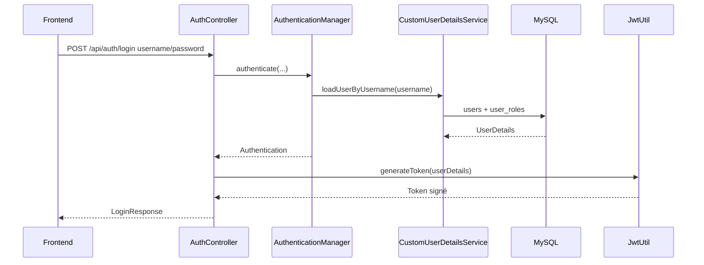

### 6.3 Validation JWT

`JwtFilter` s’exécute avant `UsernamePasswordAuthenticationFilter`.

Étapes:

1. Lecture du header `Authorization`.
2. Vérification du préfixe `Bearer `.
3. Extraction du username depuis le token.
4. Chargement de l’utilisateur via `CustomUserDetailsService`.
5. Validation du subject et de l’expiration.
6. Création d’un `UsernamePasswordAuthenticationToken`.
7. Injection dans `SecurityContextHolder`.

### 6.4 Politique d’accès

| Ressource | Politique |
|---|---|
| `/api/auth/**` | Public |
| Static HTML backend | Public |
| Swagger paths | Public, même si aucune dépendance OpenAPI n’est détectée |
| GET `/api/products/**` | Authentifié |
| POST/PUT/DELETE `/api/products/**` | Admin |
| `/api/admin/**` | Admin |
| Autres endpoints | Authentifié |

Points d’attention:

| Risque | Analyse | Recommandation |
|---|---|---|
| Secret JWT par défaut dans `application.properties` | Présent pour dev, dangereux si utilisé en production | Obliger `JWT_SECRET` en environnement |
| CORS `*` | Pratique en dev, permissif en prod | Restreindre à l’URL frontend |
| Endpoints events POST/PUT/DELETE | Commentaires indiquent admin, mais `SecurityConfig` ne les restreint pas explicitement | Ajouter règles admin ou `@PreAuthorize` |
| PATCH stock produit | Commentaire admin, mais PATCH non couvert par règle admin produit | Restreindre PATCH à `ROLE_ADMIN` |
| `/api/users` et `/api/users/{id}` | Commentaire admin, mais pas de `@PreAuthorize` | Ajouter `@PreAuthorize("hasAuthority('ROLE_ADMIN')")` |
| Comptes de test | Credentials en clair dans le code | Retirer ou protéger par profil `dev` |
| LocalStorage pour JWT | Simple mais exposé aux scripts XSS | Renforcer CSP, validation frontend, éventuellement cookie HttpOnly |

## 7. Système de recommandation

### 7.1 Présence d’IA ou ML

Il n’y a pas de modèle ML entraîné, pas de pipeline Python, pas d’embeddings, pas de NLP Hugging Face, pas de vector database, pas de cosine similarity et pas de collaborative filtering dans le dépôt.

Le système de recommandation réel est un moteur déterministe côté frontend dans `frontend/src/data/recommendationEngine.js`.

### 7.2 Logique métier

Entrées:

| Entrée | Source |
|---|---|
| Profil utilisateur | Profil backend ou localStorage |
| Produits | API `/products` |
| Événements | API `/events` |
| Programmes | API `/coaching/programs` + programmes locaux |

Sorties:

| Sortie | Description |
|---|---|
| `products` | Jusqu’à 6 produits recommandés |
| `events` | Jusqu’à 4 événements |
| `programs` | Jusqu’à 3 programmes |
| `quickCatalog` | Sélection courte |
| `nearestStore` | Magasin Decathlon local prédéfini |
| `hasExactMatches` | Indique si des recommandations exactes ont été trouvées |

### 7.3 Scoring produit

Le scoring produit est:

```text
score = 18
      + 32 si catégorie/nom/description correspondent au hobby
      + 24 si catégorie/nom/description correspondent à l’objectif
      + 18 si prix <= budget
      - pénalité si prix > budget
```

La pénalité est:

```text
min(22, round((prix - budget) / 120))
```

Le score final est borné:

```text
score_final = max(0, min(99, score))
```

### 7.4 Scoring événement

```text
score = 18
      + 38 si ville événement = ville utilisateur
      + 24 si le contenu correspond au hobby
      + 24 si le contenu correspond à l’objectif
```

Un événement recommandé doit aussi être pertinent via:

```text
isEventRelevant = match(hobby) OR match(objective)
```

### 7.5 Scoring programme

```text
score = 18
      + 22 si niveau programme = niveau utilisateur
      + 28 si catégorie/titre/description correspondent au hobby
      + 30 si objectif/catégorie/titre/description correspondent à l’objectif
```

### 7.6 Nature algorithmique

Ce moteur est un système de recommandation content-based simplifié:

| Aspect | Implémentation |
|---|---|
| Vectorisation | Non |
| Similarité cosinus | Non |
| Embeddings | Non |
| Filtrage collaboratif | Non |
| Deep learning | Non |
| NLP avancé | Non |
| Normalisation texte | Minuscule + suppression accents |
| Matching | Inclusion de chaînes |
| Persistance historique | `localStorage` |

## 8. FastAPI / Microservices Python

Aucun dossier Python, fichier `requirements.txt`, `pyproject.toml`, endpoint FastAPI, worker Ray ou microservice ML n’a été détecté.

Il n’existe donc pas de communication Spring Boot vers FastAPI dans le code actuel. Toute la logique backend est dans le monolithe Spring Boot, et la recommandation est exécutée côté frontend.

## 9. DevOps et CI/CD

### 9.1 Éléments DevOps présents

| Élément | Présence | Description |
|---|---:|---|
| Dockerfile backend | Oui | Build Maven puis image JRE |
| Dockerfile frontend | Oui | Build Vite puis Nginx |
| Dockerfile database | Oui | MySQL avec dump init |
| docker-compose.yml | Oui | Orchestration locale complète |
| GitHub Actions | Non | Aucun workflow `.github/workflows` |
| Jenkins | Non | Aucun `Jenkinsfile` |
| Kubernetes | Non | Aucun manifest |
| Monitoring | Non | Aucun Prometheus/Grafana/Actuator configuré |

### 9.2 Pipeline Docker implicite

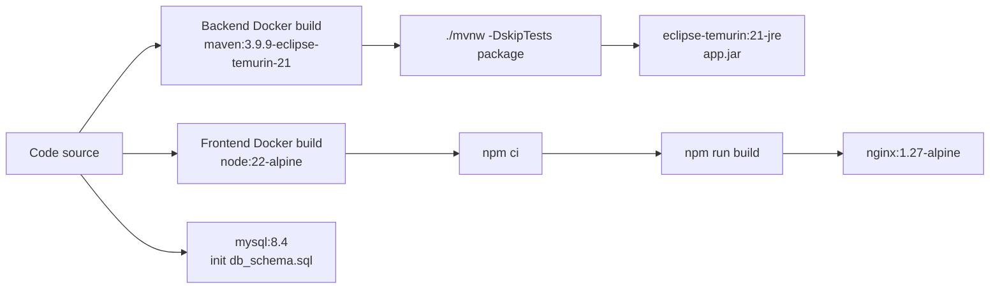

### 9.3 Limites CI/CD

Le projet ne contient pas de pipeline automatisée pour:

| Étape | Statut |
|---|---|
| Build backend CI | Non défini |
| Tests backend CI | Non défini |
| Build frontend CI | Non défini |
| Lint frontend | Non défini |
| Analyse sécurité | Non défini |
| Push image Docker | Non défini |
| Déploiement staging/prod | Non défini |
| Rollback | Non défini |

## 10. Docker

### 10.1 Backend

Le Dockerfile backend utilise un build multi-stage:

| Étape | Image | Action |
|---|---|---|
| Build | `maven:3.9.9-eclipse-temurin-21` | Copie code, exécute `./mvnw -DskipTests package` |
| Runtime | `eclipse-temurin:21-jre` | Copie le JAR en `app.jar`, expose 8081 |

### 10.2 Frontend

Le Dockerfile frontend:

| Étape | Image | Action |
|---|---|---|
| Build | `node:22-alpine` | `npm ci`, build Vite avec `VITE_API_URL` |
| Runtime | `nginx:1.27-alpine` | Sert le contenu `dist` |

`nginx.conf` utilise:

```nginx
try_files $uri $uri/ /index.html;
```

Cela permet aux routes React comme `/app/products/1` de fonctionner au rechargement.

### 10.3 Base de données

L’image database:

```dockerfile
FROM mysql:8.4
COPY init/db_schema.sql /docker-entrypoint-initdb.d/db_schema.sql
```

MySQL exécute automatiquement le dump au premier démarrage du volume.

### 10.4 Docker Compose

Flux de démarrage:

1. `mysql` démarre et initialise `sport_db`.
2. Le healthcheck attend que MySQL réponde.
3. `backend` démarre après MySQL healthy.
4. `frontend` démarre après backend.

Variables sensibles actuellement présentes dans `docker-compose.yml`:

| Variable | Valeur dev |
|---|---|
| `MYSQL_USER` | `reda` |
| `MYSQL_PASSWORD` | `reda123` |
| `MYSQL_ROOT_PASSWORD` | `root123` |
| `SPRING_DATASOURCE_PASSWORD` | `reda123` |

## 11. Kubernetes

Aucun fichier Kubernetes n’a été détecté. Il n’existe donc pas de:

| Ressource | Statut |
|---|---|
| Deployment | Absent |
| Service | Absent |
| Ingress | Absent |
| ConfigMap | Absent |
| Secret | Absent |
| HPA/autoscaling | Absent |
| Namespace | Absent |

Une migration Kubernetes future devrait convertir les trois services Compose en:

| Compose | Kubernetes cible |
|---|---|
| `mysql` | `StatefulSet` + PVC + Secret |
| `backend` | `Deployment` + Service ClusterIP |
| `frontend` | `Deployment` + Service/Ingress |

## 12. Flux complet de l’application

### 12.1 Inscription

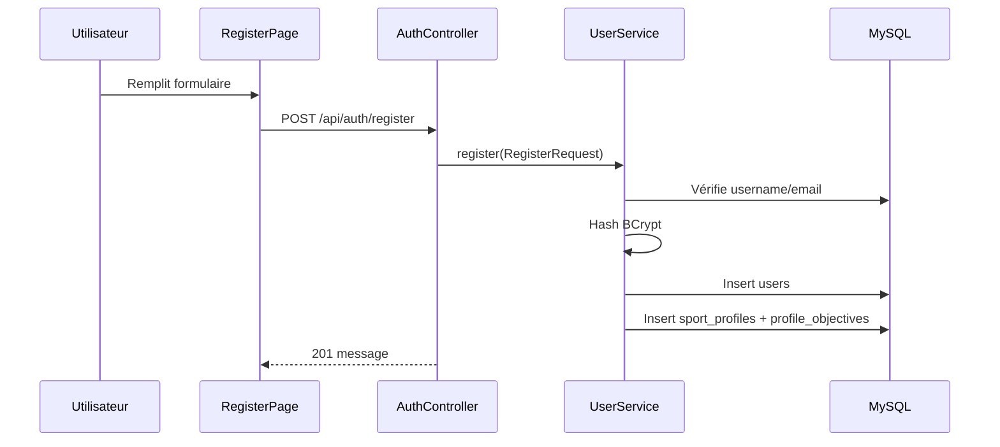

### 12.2 Connexion et appel API

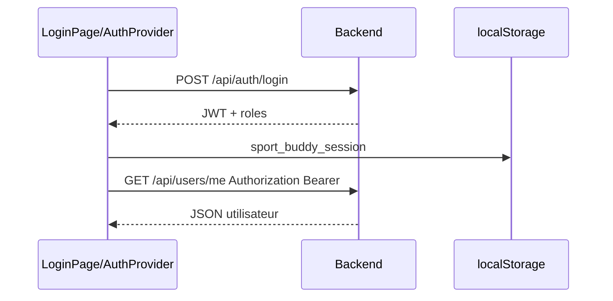

### 12.3 Consultation produits

1. La page React appelle `getProducts(filters)`.
2. `apiFetch` ajoute le JWT.
3. `ProductController.getAll` choisit:
   - `searchForCatalogue` si `search` existe.
   - `findByCategoryForCatalogue` si `category` existe.
   - `findAllForCatalogue` sinon.
4. `ProductService` interroge d’abord `catalogue_produits` via `JdbcTemplate`.
5. Si aucune donnée n’est disponible, fallback vers `ProductRepository`.
6. La réponse est normalisée en `ProductResponse`.

### 12.4 Démarrage et complétion d’une séance

1. L’utilisateur consulte un programme.
2. Le frontend appelle `POST /api/coaching/sessions/start?programId=...`.
3. `CoachingService.startSession` charge `User` et `TrainingProgram`.
4. Une ligne `sessions` est créée avec `done=false`.
5. À la fin, le frontend appelle `POST /api/coaching/sessions/{id}/complete`.
6. Le service vérifie que la séance appartient à l’utilisateur.
7. `done=true`, `completedAt=now`.
8. L’utilisateur reçoit `+10` points de fidélité.

### 12.5 Recommandation frontend

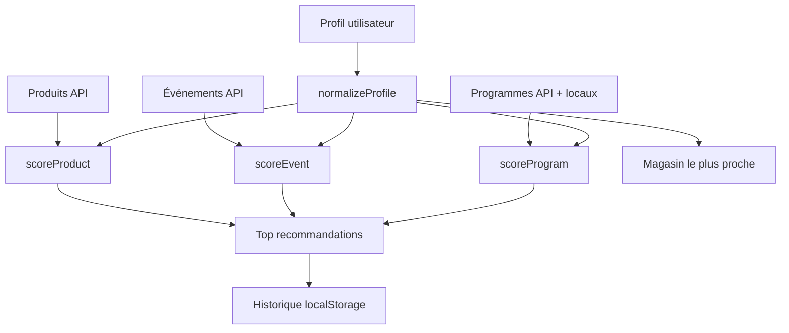

## 13. Analyse frontend

### 13.1 Architecture

| Dossier/fichier | Rôle |
|---|---|
| `src/main.jsx` | Bootstrap React, QueryClient, Router, AuthProvider |
| `src/App.jsx` | Définition des routes |
| `src/auth` | Session, routes protégées et admin |
| `src/api` | Clients API par domaine |
| `src/pages` | Pages publiques, utilisateur et admin |
| `src/layouts/AppLayout.jsx` | Layout applicatif |
| `src/data/recommendationEngine.js` | Recommandations côté client |
| `src/styles` | CSS modules et global |

### 13.2 Routing

| Route | Accès | Page |
|---|---|---|
| `/` | Public | Landing |
| `/login` | Public | Login |
| `/register` | Public | Register |
| `/app` | Authentifié | Dashboard |
| `/app/products` | Authentifié | Produits |
| `/app/products/:id` | Authentifié | Détail produit |
| `/app/programs` | Authentifié | Programmes |
| `/app/programs/:id/launch` | Authentifié | Lancement programme |
| `/app/programs/:id/session/:sessionNumber` | Authentifié | Runner séance |
| `/app/events` | Authentifié | Événements |
| `/app/advice` | Authentifié | Conseils sportifs |
| `/app/profile` | Authentifié | Profil |
| `/app/admin` | Admin | Dashboard admin |
| `/app/admin/products` | Admin | Gestion produits |
| `/app/admin/events` | Admin | Gestion événements |
| `/app/admin/programs` | Admin | Gestion programmes |
| `/app/admin/users` | Admin | Utilisateurs |
| `/app/data` | Admin | Exploration SQL |

### 13.3 Authentification frontend

`AuthProvider` maintient:

| Élément | Source |
|---|---|
| `session` | `localStorage.sport_buddy_session` |
| `isAuthenticated` | Présence d’un token |
| `isAdmin` | Présence de `ROLE_ADMIN` |
| `signIn` | Stocke la session |
| `signOut` | Supprime la session et vide React Query |
| `refreshSession` | Met à jour session et localStorage |

`apiFetch` ajoute automatiquement:

```http
Authorization: Bearer <token>
Content-Type: application/json
```

### 13.4 Gestion état et appels API

Le frontend utilise TanStack React Query:

| Usage | Exemple |
|---|---|
| Cache GET | Produits, événements, programmes, profil |
| Mutations | Création/suppression admin, profil, réactions |
| Invalidation | Via `useQueryClient` dans plusieurs pages |
| Retry | `retry: 1` global |
| Stale time | 30 secondes |

### 13.5 Pages principales

| Page | Rôle |
|---|---|
| `DashboardPage` | Vue synthétique, statistiques, recommandations |
| `ProductsPage` | Catalogue filtrable |
| `ProductDetailPage` | Détail et disponibilité |
| `ProgramsPage` | Catalogue programmes |
| `ProgramLaunchPage` | Détail/lancement d’un programme |
| `SessionRunnerPage` | Exécution/complétion de séance |
| `EventsPage` | Liste d’événements |
| `SportsAdvicePage` | Conseils statiques |
| `ProfilePage` | Lecture/modification profil |
| Pages admin | CRUD et reporting |

## 14. Qualité logicielle

### 14.1 Points forts

| Point fort | Détail |
|---|---|
| Séparation en couches | Controllers, services, repositories, DTO |
| Transactions explicites | `@Transactional` read/write cohérent |
| Sécurité stateless | JWT + BCrypt + rôles |
| DTO de réponse | Produits/programmes/séances évitent certains cycles JPA |
| `open-in-view=false` | Encourage les chargements contrôlés |
| `@EntityGraph` | Limite certains problèmes lazy loading |
| Docker Compose complet | Lancement local reproductible |
| Fallback catalogue | Si tables importées absentes, fallback JPA |
| Exploration sécurisée par allowlist | `DataExplorerController` limite les tables consultables |

### 14.2 Problèmes potentiels

| Problème | Impact | Recommandation |
|---|---|---|
| Encodage texte corrompu dans plusieurs fichiers | Messages affichés avec caractères cassés | Convertir les fichiers en UTF-8 propre |
| Secrets de dev versionnés | Risque sécurité si réutilisés | Variables d’environnement obligatoires |
| CORS wildcard | Surface d’abus en production | Restreindre aux domaines connus |
| PATCH produit non explicitement admin | Modification stock possible pour utilisateur authentifié | Ajouter règle admin PATCH |
| CRUD events non explicitement admin | Modification événements possible pour utilisateur authentifié | Ajouter `@PreAuthorize` |
| `/api/users` non explicitement admin | Exposition données utilisateurs | Ajouter autorisation admin |
| `AdminDashboardService` utilise `findAll().stream()` pour compter séances terminées | Peu scalable | Ajouter `countByDoneTrue()` |
| Tables importées avec noms de colonnes atypiques | Maintenance difficile | Créer vues SQL propres ou ETL de normalisation |
| Recommandations côté client | Score manipulable et non centralisé | Déplacer en backend si besoin métier fort |
| Tests minimaux | Faible assurance régression | Ajouter tests services/controllers |

### 14.3 Design patterns observés

| Pattern | Présence |
|---|---|
| Layered Architecture | Oui |
| Repository pattern | Oui via Spring Data |
| DTO pattern | Partiel |
| Dependency Injection | Oui via constructor injection Lombok |
| Builder pattern | Oui via Lombok `@Builder` |
| Global exception handling | Oui via `@RestControllerAdvice` |
| Stateless authentication | Oui |

## 15. Tests

### 15.1 Tests présents

Le projet contient un seul test:

```java
@SpringBootTest
class DecathlonProjectApplicationTests {
    @Test
    void contextLoads() {
    }
}
```

Ce test vérifie uniquement que le contexte Spring démarre. Il ne valide pas:

| Domaine | Couverture actuelle |
|---|---|
| Contrôleurs REST | Non couvert |
| Services métier | Non couvert |
| Repositories | Non couvert |
| Sécurité JWT | Non couvert |
| Validation DTO | Non couvert |
| Frontend | Non couvert |
| Docker Compose | Non couvert |

### 15.2 Stratégie recommandée

| Niveau | Framework possible | Cibles |
|---|---|---|
| Unitaires services | JUnit 5 + Mockito | `UserService`, `CoachingService`, `ReactionService` |
| Web MVC | Spring MockMvc | Auth, produits, événements |
| Sécurité | spring-security-test | Rôles, endpoints admin |
| Intégration DB | Testcontainers MySQL | JPA + migrations/dump |
| Frontend | Vitest + Testing Library | AuthProvider, pages critiques |
| E2E | Playwright | Login, catalogue, séance, admin |

## 16. Synthèse d’architecture et recommandations

### 16.1 Architecture réelle déduite

Le projet est une application full-stack monolithique côté backend, avec frontend SPA séparé et base MySQL. Il ne s’agit pas d’une architecture microservices ni MLOps au sens strict. L’aspect recommandation est un algorithme heuristique frontend, pas un modèle ML.

### 16.2 Flux de données principal

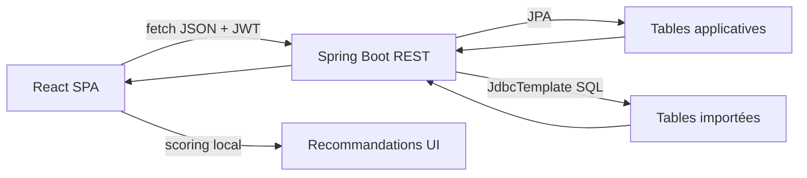

### 16.3 Priorités d’amélioration

| Priorité | Action |
|---:|---|
| 1 | Corriger règles de sécurité admin sur users/events/stock |
| 2 | Externaliser tous les secrets |
| 3 | Ajouter tests services + contrôleurs critiques |
| 4 | Nettoyer encodage UTF-8 |
| 5 | Normaliser les tables importées via vues SQL propres |
| 6 | Ajouter pipeline CI GitHub Actions |
| 7 | Ajouter health endpoint Spring Actuator |
| 8 | Centraliser ou documenter formellement le moteur de recommandation |

## 17. Conclusion

Decathlon Sport Buddy est une application web cohérente, orientée coaching sportif et catalogue Decathlon, construite autour d’un backend Spring Boot sécurisé par JWT, d’un frontend React moderne et d’une base MySQL riche en données importées.

Le cœur applicatif est proprement séparé en couches et déjà exploitable localement via Docker Compose. Les principaux axes de professionnalisation concernent la sécurité d’autorisation fine, la gestion des secrets, l’industrialisation CI/CD, la couverture de tests et la normalisation des données importées.

Le projet ne contient actuellement pas de microservices Python, de pipeline MLOps, de Kafka, Redis, Kubernetes, Jenkins, Ray, MLflow ou Hugging Face. Toute documentation les concernant serait spéculative; ils sont donc explicitement marqués comme absents dans ce rapport.
